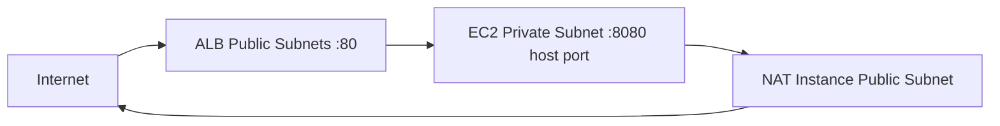

Deploy a dockerized NGINX app that is publicly reachable and returns exactly:

```text
yo this is nginx
```

This repository supports both a one-click assignment path and a production-style pattern:
- Build image once in CI (or manually), push to private ECR
- Deploy infra with Terraform
- EC2 in private subnet pulls the image tag provided by Terraform (CI uses immutable commit SHA; if `app_image_uri` is empty, Terraform builds/pushes during apply)

## Architecture



## Security Posture (Assignment)

- Public entry point is an internet-facing ALB on HTTP/80 (required for public access).
- App EC2 is private: no public IP and deployed in the private subnet.
- No SSH exposure: there are no port 22 security group rules; access is only through the ALB.
- Security groups are SG-to-SG: ALB -> app only on `var.app_port`; app egress is restricted to HTTPS (443) and DNS to the VPC resolver.
- Instance hardening: IMDSv2 is required; root EBS volumes are encrypted.
- CI/CD uses GitHub OIDC (no static AWS keys) with separate plan/build vs apply roles; apply is gated via the GitHub `production` environment (required reviewers configured in GitHub).
- Image immutability: ECR repo is IMMUTABLE; CI tags images by commit SHA (no `latest`).
- Intentional assignment trade-offs: HTTP instead of HTTPS, NAT instance instead of NAT gateway, CI-managed state copy instead of native Terraform S3 backend + DynamoDB locking.

## Naming and Tagging Convention

- Provider-level default tags are set in `infra/providers.tf`:
  - `Project = var.name_prefix`
  - `ManagedBy = Terraform`
- Every taggable resource includes a specific `Name` tag (for example `yo-this-is-ngnix-app`, `yo-this-is-ngnix-alb`).
- Functional tags such as `Role` and `Tier` are used where they add operational value.
- Result: AWS Console and Cost Explorer filtering is consistent and searchable.

## What Is In Scope

- VPC with public and private subnets
- Internet-facing ALB forwarding to private app instance
- App EC2 bootstrap via `user_data` that:
  - installs Docker
  - logs into ECR
  - pulls `app_image_uri`
  - runs container on host port `8080`
- GitHub Actions OIDC workflow with environment approval gate for apply

## CI and security scanning (tfsec)

The pipeline runs [tfsec](https://aquasecurity.github.io/tfsec/) on the Terraform in `infra/`. tfsec is configured with **soft_fail: true**: findings are reported in the job log but do not fail the build. This is intentional for this assignment: the design uses a **public ALB** and **HTTP on port 80** so the app is reachable from the internet as required; tfsec would flag these (and e.g. broad security group CIDRs, no VPC flow logs) as issues. In production you would address those (HTTPS, tighter rules, flow logs) or add tfsec ignore comments where the trade-off is accepted.

## Repository Layout

- `infra/` Terraform root module
- `infra/templates/user_data_app.sh.tftpl` app bootstrap (pull and run from ECR)
- `infra/templates/user_data_nat.sh.tftpl` NAT setup
- `docker/Dockerfile` container build definition
- `docker/nginx.conf` NGINX response config
- `docker/verify.sh` local functional check
- `.github/workflows/deploy.yml` build + plan/apply pipeline
- `docs/github-actions/trust-policy.json` OIDC trust policy example
- `docs/github-actions/permissions-policy.json` IAM permissions policy example

## Prerequisites

- AWS account with permissions for VPC, EC2, ALB, IAM, EIP, S3, ECR
- Terraform (version compatible with `infra/versions.tf`)
- AWS CLI
- Docker with Buildx (`docker buildx version`)

## Local Verification (Optional)

```bash
docker build -f docker/Dockerfile -t yo-nginx:local .
docker run --rm -p 8080:80 yo-nginx:local
curl -s http://localhost:8080/
```

Expected output:

```text
yo this is nginx
```

Or run the bundled check:

```bash
./docker/verify.sh
```

## Step-by-Step: Local Deploy (Manual, End-to-End)

### 1) Configure shell + AWS credentials

Example:

```bash
set -euo pipefail
export AWS_PROFILE=default
export AWS_REGION=us-east-1
aws sts get-caller-identity
```

### 2) One-click apply (fully self-contained)

If you do not provide `-var "app_image_uri=..."`, Terraform will build and push the Docker image to ECR during `terraform apply`,
then deploy the private EC2 instance which pulls and runs it.

```bash
terraform -chdir=infra init
terraform -chdir=infra apply
```

If you prefer the production-style flow (build in CI or manually), follow the build/push path below and pass `-var "app_image_uri=..."`.

### 3) Build and push an amd64 image to ECR (production-style, optional)

`amd64` is important because the current Terraform AMI/instance path is x86_64.

```bash
REGION="${AWS_REGION:-us-east-1}"
ACCOUNT_ID=$(aws sts get-caller-identity --query Account --output text)
ECR_REPOSITORY="yo-this-is-ngnix-app"
APP_IMAGE_URI="${ACCOUNT_ID}.dkr.ecr.${REGION}.amazonaws.com/${ECR_REPOSITORY}:manual-$(date +%Y%m%d%H%M%S)"

aws ecr describe-repositories --repository-names "${ECR_REPOSITORY}" --region "${REGION}" >/dev/null 2>&1 || \
  aws ecr create-repository --repository-name "${ECR_REPOSITORY}" --region "${REGION}"

aws ecr get-login-password --region "${REGION}" | \
  docker login --username AWS --password-stdin "${ACCOUNT_ID}.dkr.ecr.${REGION}.amazonaws.com"

docker buildx build --platform linux/amd64 -f docker/Dockerfile -t "${APP_IMAGE_URI}" --push .
```

### 4) Deploy Terraform using that exact image URI

Use a saved plan so the reviewed plan is exactly what gets applied.
(`tfplan`/`destroy.tfplan` are ephemeral artifacts and should not be committed.)

```bash
terraform -chdir=infra init
terraform -chdir=infra fmt -check
terraform -chdir=infra validate
terraform -chdir=infra plan -out=tfplan -var "app_image_uri=${APP_IMAGE_URI}"
terraform -chdir=infra show tfplan
terraform -chdir=infra apply tfplan
rm -f infra/tfplan
```

### 5) Verify

```bash
curl -s "$(terraform -chdir=infra output -raw app_url)"
```

Expected output:

```text
yo this is nginx
```

### 6) Destroy

Recommended (reviewed destroy plan):

```bash
terraform -chdir=infra plan -destroy -out=destroy.tfplan -var "app_image_uri=${APP_IMAGE_URI}"
terraform -chdir=infra apply destroy.tfplan
rm -f infra/destroy.tfplan
```

Quick option:

```bash
terraform -chdir=infra destroy -var "app_image_uri=${APP_IMAGE_URI}"
```

## GitHub Actions Flow (Automated)

Workflow file: `.github/workflows/deploy.yml`

### Trigger behavior

- push to `develop`:
  - build and push image to ECR (`<commit_sha>`)
  - Terraform fmt/validate/plan
- push to `main`:
  - build and push image to ECR (`<commit_sha>`)
  - Terraform fmt/validate/plan
  - Terraform apply after `production` environment approval
  - post-apply smoke test validates response is exactly `yo this is nginx`
  - deployment URL is published to the GitHub `production` environment

### Workflow hardening notes

- Third-party actions are pinned to commit SHAs (not only version tags) to reduce supply-chain risk.

### One-time AWS setup

1. Create GitHub OIDC provider in AWS IAM:
   - URL: `https://token.actions.githubusercontent.com`
   - Audience: `sts.amazonaws.com`
2. Create two IAM roles:
   - `plan/build` role for branch pushes (`main`, `develop`)
   - `apply` role for `production` environment deployments only
3. Attach assignment-scoped policies:
   - `plan/build` role: ECR build/push + Terraform read/plan + state-bucket bootstrap/read (assignment scope)
   - `apply` role: Terraform apply writes + pass-role + state object read/write (assignment scope)

Use provided examples:
- `docs/github-actions/trust-policy-plan.json`
- `docs/github-actions/permissions-policy-plan.json`
- `docs/github-actions/trust-policy.json` (apply role)
- `docs/github-actions/permissions-policy.json` (apply role)

If you are using a different AWS account or repository, replace account/repo literals in those JSON files before applying:
- `689254730158` -> your AWS account ID
- `YonKu0/yo_this_is_ngnix` -> your `OWNER/REPO`

Optional automation (recommended):

```bash
sh docs/github-actions/set_oidc_policy.sh --repo <OWNER>/<REPO> --set-gh-vars
```

Preview first (no changes):

```bash
sh docs/github-actions/set_oidc_policy.sh --repo <OWNER>/<REPO> --set-gh-vars --dry-run
```

### One-time GitHub repo setup

1. Create environment: `production`
2. Add required reviewers for that environment
3. Add repo variables:
   - `AWS_REGION`
   - `AWS_PLAN_ROLE_ARN`
   - `AWS_APPLY_ROLE_ARN`

## Reviewer Notes

- This repo intentionally demonstrates clear infra boundaries and explicit image selection (immutable tags in CI path).
- Provider dependency locking is maintained via `infra/.terraform.lock.hcl` for consistent Terraform provider resolution across machines/CI.
- Current AMI selection uses `most_recent = true` (automatic patch pickup), which can trigger instance replacement on future applies; stricter reproducibility would pin AMI per environment.
- For further hardening: NAT Gateway, remote Terraform backend with locking, HTTPS listener + ACM, and ECR lifecycle policies.

## Production Design Next Step

This assignment implementation is intentionally simple. In a real production system, the next iteration would be:

1. State backend and locking
   - Use native Terraform remote state (`backend "s3"`) instead of CI `aws s3 cp` state copy.
   - Enable S3 encryption with KMS, versioning, and strict bucket IAM.
   - Use DynamoDB state locking to prevent concurrent apply corruption.
   - Separate environments with isolated state keys (and ideally separate AWS accounts).
2. CI quality and security gates
   - PR pipeline: `terraform fmt -check`, `terraform validate`, `tflint`, `tfsec` or `checkov`, then `plan`.
   - Post plan output to PR, and allow apply only from `main` with approval gates.
3. Drift detection
   - Add scheduled workflow (for example daily) that runs `terraform plan -detailed-exitcode`.
   - Notify/open issue when drift is detected so infrastructure stays codified.
